# 全 30 图类型 + Frontmatter 浏览器冒烟测试（轮2）

> **目的**：Node sandbox 因 zustand 依赖缺失，14 种图无法在单元测试中验证 parse（见
> `tests/unit/renderAllTypes.test.js`）。本清单在**真实浏览器**里逐图验证渲染，覆盖全部
> 30 个图表类型 + frontmatter config + bare/-beta 关键字变体。
>
> **依据**：ROUND1-RESEARCH.md（30 图关键字）、ROUND1-BUNDLE.md（detector 正则）、
> ROUND1-CODE-AUDIT.md（bare/-beta 实测矩阵）。
>
> **执行方式**：
> 1. 启动 server：`node src/server/index.js`（需 `.env` 配好 LLM 三变量）
> 2. 浏览器打开 `http://localhost:3000`
> 3. 注册并登录一个测试用户，左侧抽屉建一个新会话
> 4. 把每节的 mermaid 代码贴到代码编辑器（600ms 防抖后自动重渲染）
> 5. 验证：预览区有 SVG + 节点/边正确显示 + 点击"导出 PNG"得到非空 PNG
>
> **PASS 标准**：预览区显示 SVG，节点/边/文字正确，无 "Render Error"。
> **FAIL 标准**：预览区显示 "Render Error" / SVG 节点缺失 / 中文乱码 / PNG 导出失败。
>
> **sandbox 限制图标记**：[BLK] = 单元测试中 sandbox-blocked，**必须浏览器验证**。

---

## 启动服务

```bash
cd /Users/setsunayang/Documents/GitHub/ProcessDown/.claude/worktrees/mermaid-upgrade
cp .env.example .env  # 填入 LLM_API_BASE_URL / LLM_API_KEY / LLM_MODEL
node src/server/index.js
# 浏览器打开 http://localhost:3000
```

---

## 第 1 部分：sandbox 可 parse 的图（15 个，单元测试已 PASS，浏览器确认渲染）

### 1. Flowchart

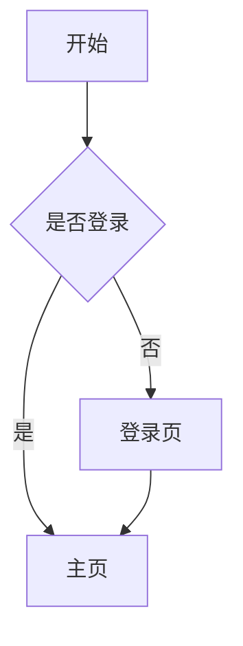

- [ ] SVG 显示 4 个节点 + 4 条边
- [ ] 中文正常
- [ ] PNG 导出正常

### 2. Sequence Diagram

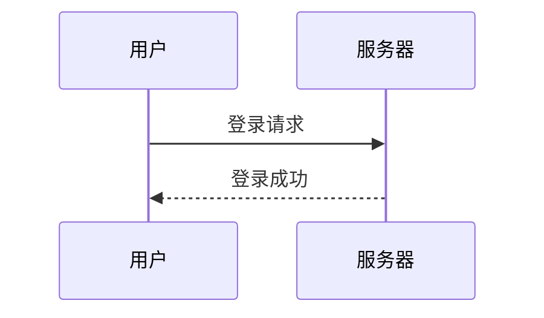

- [ ] 2 个 participant + 2 条消息
- [ ] PNG 导出正常

### 3. ER Diagram

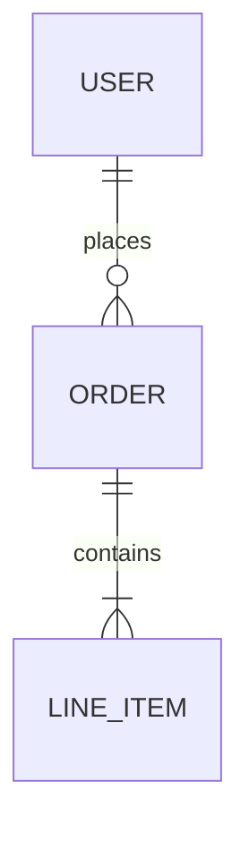

- [ ] 3 个实体 + 2 条关系
- [ ] 关系符号正确

### 4. Gantt

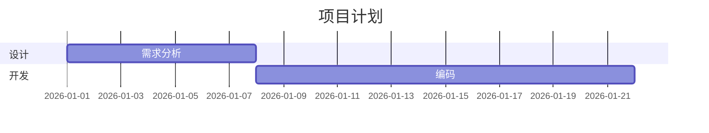

- [ ] 时间轴 + 2 个 section + 2 个 task
- [ ] PNG 导出正常

### 5. GitGraph

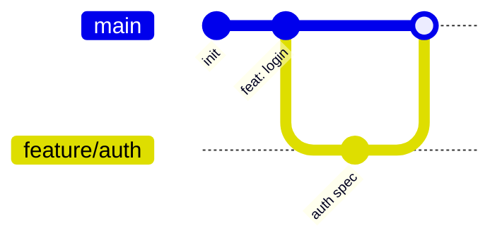

- [ ] main 分支 + feature/auth 分支 + merge 点
- [ ] commit 消息显示

### 6. Requirement Diagram

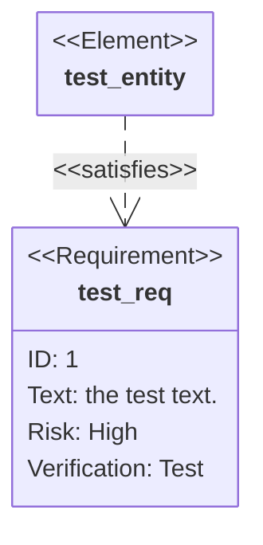

- [ ] requirement 节点 + element 节点 + satisfies 关系
- [ ] PNG 导出正常

> **注**：11.16.1 用 `element` 关键字（非 `functionalEntity`）。

### 7. Block [bare 形式，去 -beta]

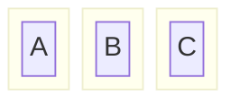

- [ ] 3 列布局 + 3 个嵌套 block
- [ ] bare `block` 关键字被接受（无 Render Error）

### 8. Packet [bare 形式，去 -beta]

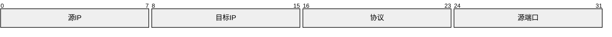

- [ ] 4 个字段块 + 位范围标注
- [ ] bare `packet` 关键字被接受

### 9. Architecture [仍需 -beta]

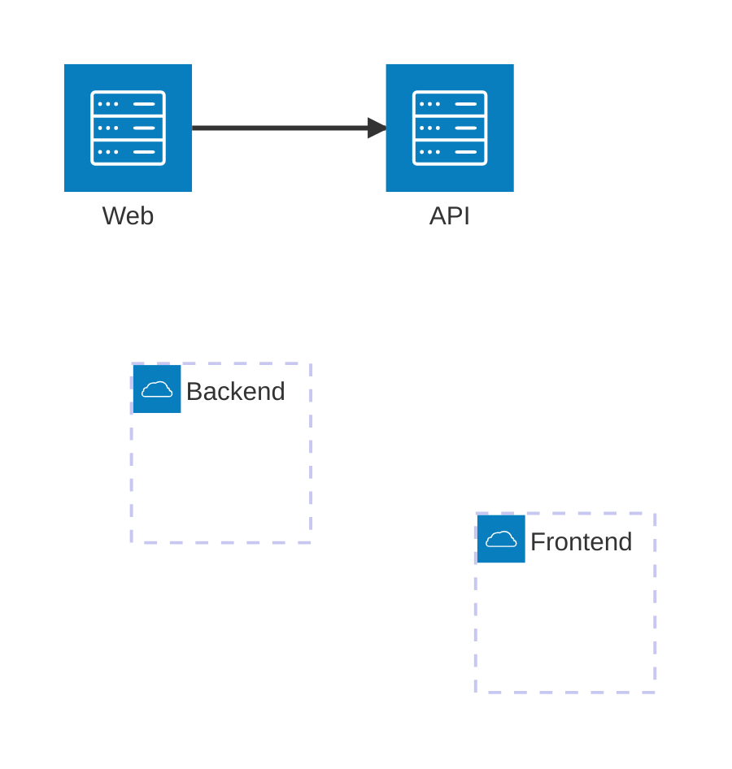

- [ ] 2 个 group + 2 个 service + 1 条边
- [ ] `architecture-beta` 关键字正常

### 10. Venn [仍需 -beta]

```mermaid
venn-beta
  set A
  set B
  intersection(A, B) : "全栈"
```

- [ ] 2 个集合 + 交集区域
- [ ] `venn-beta` 关键字正常

> **注**：11.16.1 venn 的 `set` 不接受 `[label]` 后缀，集合名直接裸写。

### 11. TreeView [仍需 -beta]

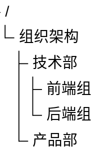

- [ ] 树形结构 + 缩进层级正确
- [ ] `treeView-beta` 关键字正常

### 12. Treemap [仍需 -beta]

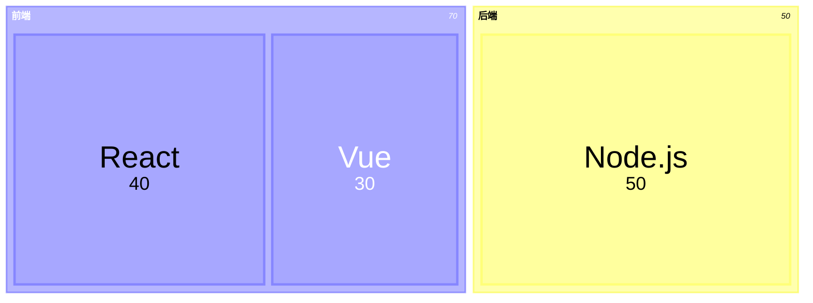

- [ ] 矩形面积反映数值
- [ ] `treemap-beta` 关键字正常

### 13. Cynefin [仍需 -beta]

```mermaid
cynefin-beta
  title 决策框架
  complex
  "深度学习"
  complicated
  "专家咨询"
  clear
  "标准流程"
  chaotic
  "危机响应"
  confusion
  "未知分类"
  clear --> chaotic : "自满"
  complex --> complicated : "模式识别"
```

- [ ] 5 个 domain 区域
- [ ] 2 条箭头 + 标题

### 14. Swimlane [仍需 -beta]

```mermaid
swimlane-beta
  A
    B
  C
    D
```

- [ ] swimlane 布局显示
- [ ] `swimlane-beta` 关键字正常

### 15. Event Modeling

```mermaid
eventmodeling
```

- [ ] 空白 eventmodeling 渲染不报错
- [ ] `eventmodeling` 关键字被接受

> **注**：eventmodeling 的 body 语法在 sandbox 中因 Langium parser 懒加载不完整。
> 浏览器中应能接受完整语法（slice/event/command/view）。若浏览器也拒绝 body，需查 mermaid 文档确认语法。

---

## 第 2 部分：sandbox 限制图（14 个，[BLK] 必须浏览器验证）

### 16. Class Diagram [BLK]

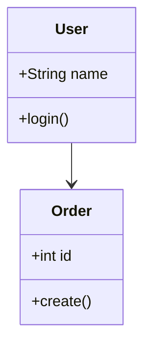

- [ ] 2 个 class + 属性/方法 + 1 条关系
- [ ] PNG 导出正常

### 17. State Diagram [BLK]

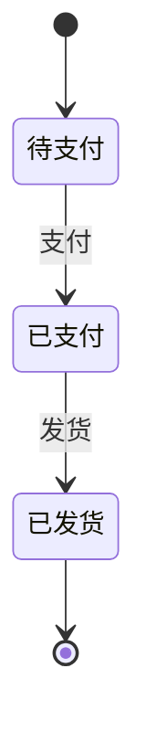

- [ ] 3 个状态 + 转换标签
- [ ] 中文状态名正常

### 18. User Journey [BLK]

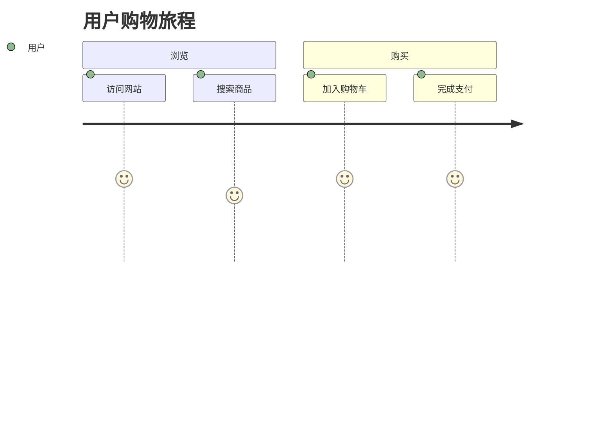

- [ ] 2 个 section + 4 个步骤 + 满意度分数
- [ ] PNG 导出正常

### 19. Pie Chart [BLK]

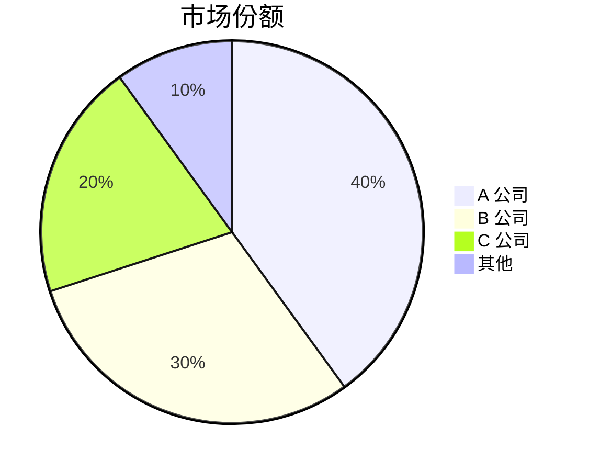

- [ ] 4 个扇区 + 百分比
- [ ] PNG 导出正常

### 20. Quadrant Chart [BLK]

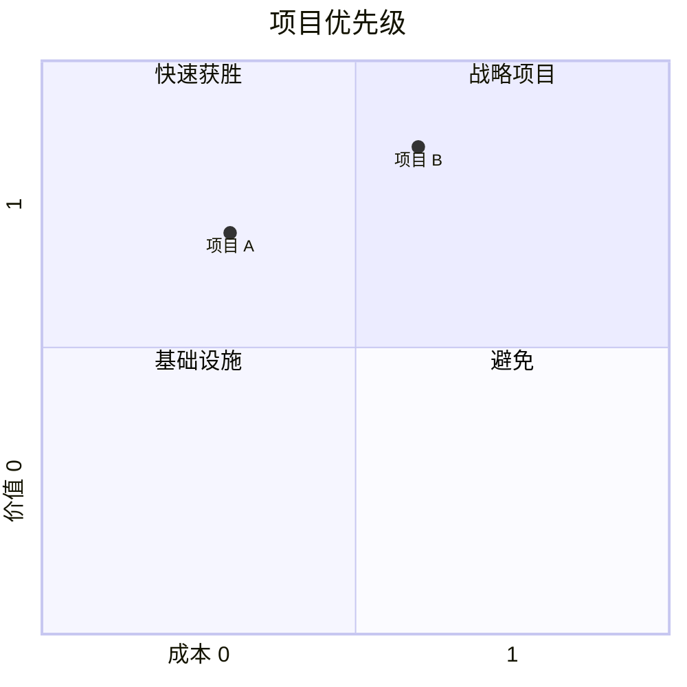

- [ ] 4 个象限 + 2 个点
- [ ] 坐标轴标签显示

### 21. C4 Context [BLK]

```mermaid
C4Context
  title 电商系统上下文
  Person(customer, "顾客", "在线购物")
  System(ecommerce, "电商平台", "处理订单")
  Rel(customer, ecommerce, "浏览/购买")
```

- [ ] Person + System 节点 + Rel 边
- [ ] PNG 导出正常

### 22. Mindmap [BLK]

```mermaid
mindmap
  root((产品开发))
    设计
      UI/UX
      原型
    开发
      前端
      后端
```

- [ ] 中心节点 + 分支展开
- [ ] 中文正常

### 23. Timeline [BLK]

```mermaid
timeline
  title 项目里程碑
  2024 Q1 : 需求评审
  2024 Q2 : 原型设计
  2024 Q3 : 开发完成
  2024 Q4 : 正式发布
```

- [ ] 时间轴 + 4 个事件
- [ ] PNG 导出正常

### 24. Sankey [BLK] [bare 形式，去 -beta]

```mermaid
sankey

A,B,124.729
B,C,0.597
B,D,26.862
```

- [ ] 4 个节点 + 3 条流线
- [ ] 流线宽度反映 value
- [ ] bare `sankey` 关键字被接受

### 25. XY Chart [BLK] [bare 形式，去 -beta]

```mermaid
xychart-beta
  title "月度销售"
  x-axis ["1月", "2月", "3月"]
  y-axis "销售额" 0 --> 100
  bar [20, 35, 45]
```

- [ ] 坐标轴 + 柱状图
- [ ] `xychart-beta` 关键字正常（bare `xychart` 也应被接受）

> **注**：11.16.1 x-axis 中文标签需双引号包裹。

### 26. Kanban [BLK]

```mermaid
kanban
  Todo
    id1[需求分析]
  Doing
    id2[后端开发]
  Done
    id3[测试]
```

- [ ] 3 列看板 + 3 个卡片
- [ ] PNG 导出正常

### 27. Radar [BLK] [仍需 -beta]

```mermaid
radar-beta
  title 性能对比
  axis 性能, 易用, 稳定, 安全
  curve "v1" {0.6, 0.7, 0.5, 0.8}
  curve "v2" {0.8, 0.85, 0.9, 0.85}
```

- [ ] 雷达图 + 4 个轴 + 2 条曲线
- [ ] `radar-beta` 关键字正常

> **注**：11.16.1 radar 的 curve 名需双引号包裹；axis 项逗号后需空格。

### 28. Ishikawa [BLK] [仍需 -beta]

```mermaid
ishikawa-beta
  Effect
  :
    Root cause
```

- [ ] 鱼骨图结构显示
- [ ] `ishikawa-beta` 关键字正常

> **注**：ishikawa-beta 的完整语法（cause category 等）需查 mermaid 文档确认。
> 上述最小示例在 sandbox 被 sandbox-blocked（zustand），浏览器应能完整渲染。

### 29. Wardley [BLK] [仍需 -beta]

```mermaid
wardley-beta
  title 技术战略
  axis Evolve --> Value
  component CRM[0.7, 0.3]
  component Cloud[0.9, 0.2]
```

- [ ] 坐标轴 + 2 个节点
- [ ] `wardley-beta` 关键字正常

> **注**：11.16.1 wardley 的节点需 `component` 关键字前缀（非裸 `Name[x, y]`）。

---

## 第 3 部分：Bundle 缺失图（不支持）

### 30. ZenUML [GAP - vendored bundle 未包含，已从 extractor 移除]

```mermaid
zenuml
  Alice
  Bob
  Alice -> Bob: 发送请求
  Bob --> Alice: 返回结果
```

- [x] **预期 FAIL**：vendored bundle 内无 zenuml detector（grep "zenuml" = 0），
      detectType 抛 UnknownDiagramError。
- [x] **已处理**：zenuml 已从 extractor.js（isMermaidCode / extractMermaidCode）与
      system.txt 移除，避免"提取通过 -> 渲染失败"陷阱。

> **发现**：zenuml 是 mermaid 官方 30 图之一，但 vendored 11.16.1 bundle 未包含其
> detector / parser（v11 中外部化为独立包）。已从 extractor 三处移除，LLM 不会被
> 引导输出 zenuml。若未来需要支持，换 bundle 或注册外部插件后再加回 extractor。

---

## 第 4 部分：Frontmatter Config 测试

### F1. Sankey + frontmatter config（用户报告案例）[BLK]

```mermaid
---
config:
  sankey:
    showValues: false
---
sankey

Agricultural 'waste',Bio-conversion,124.729
Bio-conversion,Liquid,0.597
Bio-conversion,Losses,26.862
Bio-conversion,Solid,280.322
```

- [ ] frontmatter 被接受（无 front-matter 解析错误）
- [ ] `showValues: false` 生效（节点不显示数值）
- [ ] **关键**：若 extractor.js 的 stripFrontmatter 未移除，config 应生效

### F2. Pie + frontmatter config（donutHole）[BLK]

```mermaid
---
config:
  pie:
    textPosition: 0.5
    donutHole: 0.2
  themeVariables:
    pieOuterStrokeWidth: "5px"
---
pie showData
    title Key elements in Product X
    "Calcium" : 42.96
    "Potassium" : 50.05
```

- [ ] donut 中心孔显示（donutHole: 0.2）
- [ ] 文字位置居中（textPosition: 0.5）
- [ ] 外圈描边宽度 5px

### F3. Flowchart + frontmatter title（sandbox 可验证，浏览器确认）

```mermaid
---
title: 系统架构图
---
flowchart TD
  A[客户端] --> B[服务器]
  B --> C[数据库]
```

- [ ] 标题"系统架构图"显示在图表顶部
- [ ] frontmatter 未被 stripFrontmatter 剥离

### F4. Gantt + frontmatter（title + displayMode + config）

```mermaid
---
title: Frontmatter Example
displayMode: compact
config:
  theme: forest
---
gantt
    dateFormat YYYY-MM-DD
    section Waffle
        Iron  : 1982-01-01, 3y
        House : 1986-01-01, 3y
```

- [ ] 标题显示
- [ ] compact 模式生效
- [ ] forest 主题生效

---

## 第 5 部分：Bare vs -beta 关键字变体验证

### B1. Sankey bare vs -beta

| 关键字 | 预期 | 验证 |
|--------|------|------|
| `sankey` | 接受（detector `/^\s*sankey(-beta)?/`） | [ ] 渲染正常 |
| `sankey-beta` | 接受（向后兼容别名） | [ ] 渲染正常 |

### B2. XYChart bare vs -beta

| 关键字 | 预期 | 验证 |
|--------|------|------|
| `xychart` | 接受（detector `/^\s*xychart(-beta)?/`） | [ ] 渲染正常 |
| `xychart-beta` | 接受（向后兼容） | [ ] 渲染正常 |

### B3. Block bare vs -beta

| 关键字 | 预期 | 验证 |
|--------|------|------|
| `block` | 接受（detector `/^\s*block(-beta)?/`） | [ ] 渲染正常 |
| `block-beta` | 接受（向后兼容） | [ ] 渲染正常 |

### B4. Packet bare vs -beta

| 关键字 | 预期 | 验证 |
|--------|------|------|
| `packet` | 接受（detector `/^\s*packet(-beta)?/`） | [ ] 渲染正常 |
| `packet-beta` | 接受（向后兼容） | [ ] 渲染正常 |

### B5. 仍强制 -beta 的 5 图（bare 应失败）

| 关键字 | bare 预期 | -beta 预期 | 验证 |
|--------|-----------|------------|------|
| `architecture` | FAIL（lexer 拒绝） | 接受 | [ ] bare 报错 / [ ] -beta 正常 |
| `radar` | FAIL（detector 不匹配） | 接受 | [ ] bare 报错 / [ ] -beta 正常 |
| `venn` | FAIL | 接受 | [ ] bare 报错 / [ ] -beta 正常 |
| `treeView` | FAIL | 接受 | [ ] bare 报错 / [ ] -beta 正常 |
| `cynefin` | FAIL | 接受 | [ ] bare 报错 / [ ] -beta 正常 |

---

## 执行记录

| 部分 | 总数 | 通过 | 失败 | 备注 |
|------|------|------|------|------|
| 1. sandbox 可 parse | 15 | /15 | | |
| 2. sandbox 限制 [BLK] | 14 | /14 | | 必须浏览器验证 |
| 3. bundle 缺失 [GAP] | 1 | /1 | | zenuml 已从 extractor 移除，预期 FAIL |
| 4. frontmatter config | 4 | /4 | | |
| 5. bare vs -beta | 4+5 | /9 | | |
| **总计** | **43** | **/43** | | |

> **未通过处理**：sandbox 限制图若浏览器也失败 -> 查 mermaid 文档语法 / 报上游 bug。
> zenuml -> 已从 extractor 移除（bundle 缺 detector），不引导 LLM 输出；若需支持换 bundle。
> frontmatter 若 config 未生效 -> 确认 extractor.js stripFrontmatter 调用已移除。

---

## 关联产物

- `tests/unit/renderAllTypes.test.js` - Node sandbox 30 图 parse 覆盖（15 pass / 14 BLK / 1 GAP）
- `tests/unit/v11Compat.test.js` - v11 兼容性 6 类样本实测
- `tests/unit/isMermaidCode.v11.test.js` - 25 种新图关键字识别
- `tests/e2e/mermaid-v11-smoke.md` - 原有 31 case 浏览器冒烟（部分关键字过时）
- `ROUND1-RESEARCH.md` - 30 图关键字 + 最小示例
- `ROUND1-BUNDLE.md` - bundle detector 正则实测
- `ROUND1-CODE-AUDIT.md` - extractor / system.txt / 前端问题清单
