# Mermaid v11.16.1 端到端冒烟清单（22 种新图 + 8 种 v9 图）

> **目的**：Mermaid 3.0.9 -> 11.16.1 升级后，必须在**真实浏览器**里逐图验证渲染。Node sandbox 缺 zustand 内部依赖（v11Compat.test.js 已确认），无法在单元测试里渲染 cynefin/sankey/mindmap/quadrant 等图。
>
> **依据**：IMPLEMENTATION-R2 §10.1 "必须 R2 浏览器冒烟"清单
>
> **执行方式**：
> 1. 启动 server：`node src/server/index.js`
> 2. 浏览器打开 `http://localhost:3000`
> 3. 注册并登录一个测试用户
> 4. 左侧抽屉建一个新会话
> 5. 把每一节的 mermaid 代码贴到代码编辑器（600ms 防抖后自动重渲染）
> 6. 验证：预览区有 SVG + 节点/边正确显示 + 点击"导出 PNG"得到非空 PNG
>
> **每节给出**：prompt 样例、期望 mermaid 输出、关键验证点（PASS/FAIL 标准）
>
> **不通过标准**：预览区显示 "渲染失败" / SVG 节点缺失 / 中文乱码 / PNG 导出失败

---

## 启动服务

```bash
cd /Users/setsunayang/Documents/GitHub/ProcessDown/.claude/worktrees/mermaid-upgrade
cp .env.example .env  # 填入 LLM_API_BASE_URL / LLM_API_KEY / LLM_MODEL
node src/server/index.js
# 浏览器打开 http://localhost:3000
```

---

## 第 1 部分：P0 图（用户特别关注）

### Case 1.1 — Cynefin (P0，用户明确要求)

**Prompt 样例**：
> 画一个 Cynefin 决策框架，包含 5 个 domain：复杂（深度学习）、繁杂（专家咨询）、清晰（标准流程）、混沌（危机响应）、混乱（未知分类），并画出"清晰 -> 混沌：自满"和"复杂 -> 繁杂：模式识别"两个箭头。

**期望 mermaid**：
```mermaid
cynefin-beta
title 决策框架
complex
"深度学习"
"试错迭代"
complicated
"专家咨询"
clear
"标准流程"
chaotic
"危机响应"
confusion
"未知分类"
clear --> chaotic : "自满"
complex --> complicated : "模式识别"
```

**关键验证点**：
- [ ] 5 个 domain 全部渲染（应有 5 个形状各异的区域）
- [ ] 两个箭头显示在区域间
- [ ] 标题"决策框架"在顶部
- [ ] PNG 导出中文显示正常（思源黑体）
- [ ] 截图保存到 `tests/e2e/screenshots/cynefin.png`

---

### Case 1.2 — Quadrant Chart (P0)

**Prompt 样例**：
> 画一个四象限图：x 轴"成本（低→高）"，y 轴"价值（低→高）"。4 个象限分别是"快速获胜"、"战略项目"、"基础设施"、"避免"。标注 3 个点：项目 A 在 (0.3, 0.7)，项目 B 在 (0.6, 0.85)，项目 C 在 (0.2, 0.2)。

**期望 mermaid**：
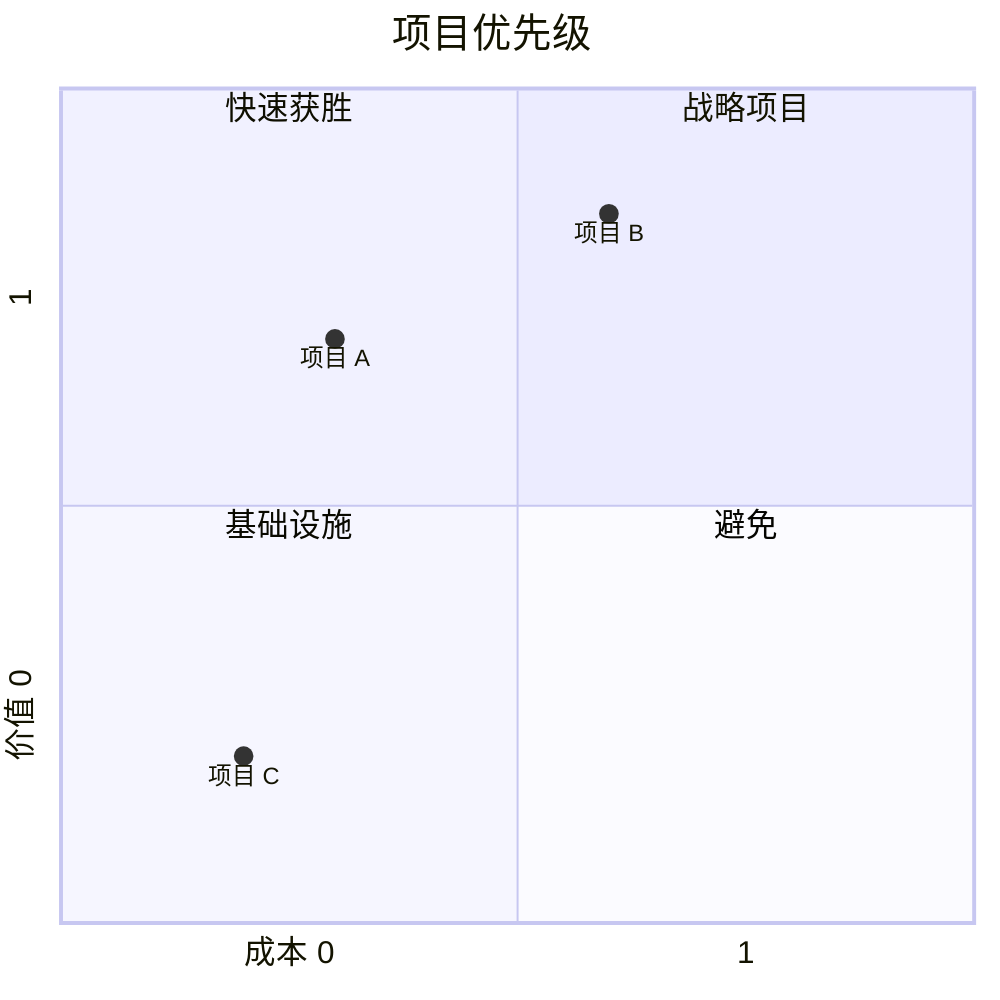

**关键验证点**：
- [ ] 4 个象限文字显示
- [ ] 3 个点（A/B/C）显示在正确位置
- [ ] 坐标轴标签显示
- [ ] PNG 导出正常
- [ ] 截图保存到 `tests/e2e/screenshots/quadrant.png`

---

### Case 1.3 — Block Diagram (P0)

**Prompt 样例**：
> 画一个 3x3 的 block-beta 布局：第 1 行是 Header，第 2 行 3 列（左侧菜单 / 主内容 / 右侧栏），第 3 行是 Footer。

**期望 mermaid**：
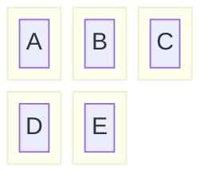

**关键验证点**：
- [ ] 3 列布局正确
- [ ] 5 个 block 块都显示
- [ ] 嵌套 block（Header/Sidebar/Main/Aside/Footer）正确显示
- [ ] PNG 导出正常
- [ ] 截图保存到 `tests/e2e/screenshots/block.png`

---

## 第 2 部分：P1 图

### Case 2.1 — Architecture (P1)

**Prompt 样例**：
> 画一个云架构：3 个 group（Frontend/Backend/Database），Frontend 里有 Web/App，Backend 里有 API/Worker，Database 里有 Primary/Replica。Web -> API, App -> API, API -> Primary, API -> Replica, API -> Worker。

**期望 mermaid**：
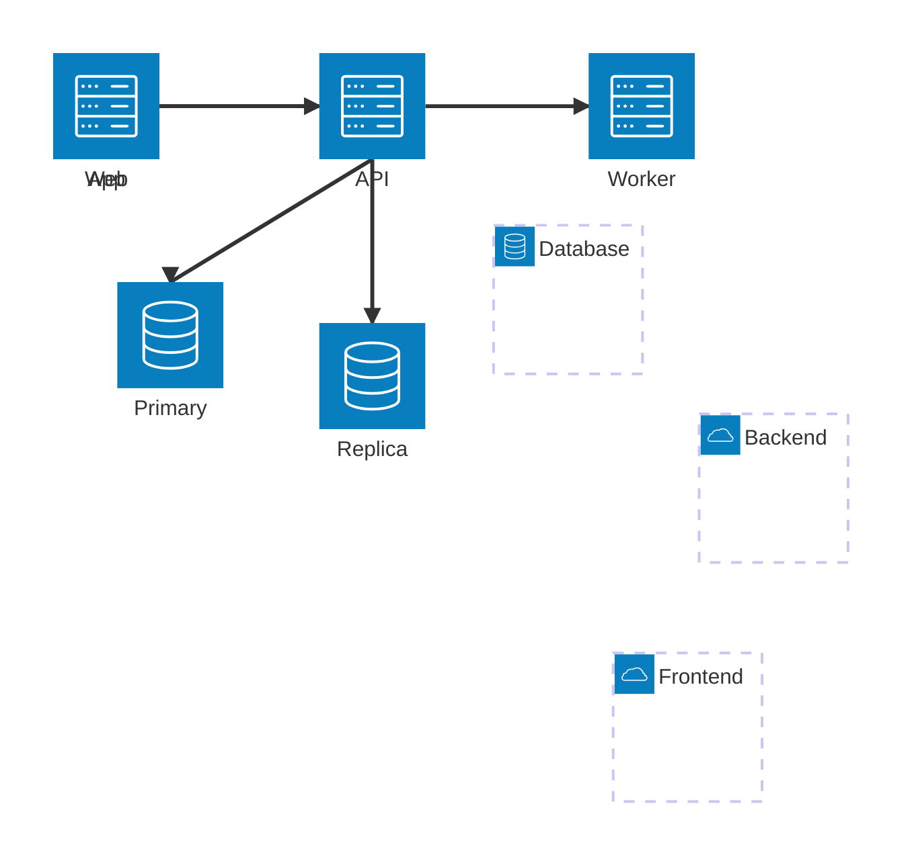

**关键验证点**：
- [ ] 3 个 group 容器显示
- [ ] 6 个 service 节点都显示
- [ ] 5 条边方向正确
- [ ] PNG 导出正常

---

### Case 2.2 — Mindmap (P1)

**Prompt 样例**：
> 画一个思维导图：中心"产品开发"，分支 1"设计"（子：UI/UX、原型），分支 2"开发"（子：前端、后端、测试），分支 3"发布"（子：内测、正式发布、监控）。

**期望 mermaid**：
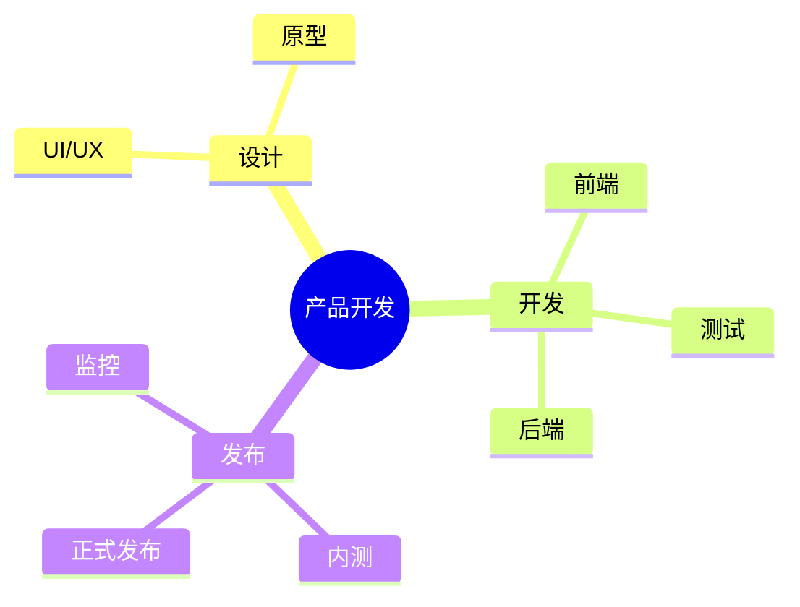

**关键验证点**：
- [ ] 中心节点显示
- [ ] 3 个一级分支 + 9 个二级节点全部显示
- [ ] PNG 导出中文正常

---

### Case 2.3 — Sankey (P1)

**Prompt 样例**：
> 画一个能源流向 Sankey 图：煤->发电(40)，天然气->发电(30)，太阳能->发电(20)，核能->发电(10)，发电->居民用电(50)，发电->工业用电(40)，发电->损耗(10)。

**期望 mermaid**：
```mermaid
sankey-beta
煤,发电,40
天然气,发电,30
太阳能,发电,20
核能,发电,10
发电,居民用电,50
发电,工业用电,40
发电,损耗,10
```

**关键验证点**：
- [ ] 4 个源节点（煤/天然气/太阳能/核能）+ 3 个目标节点（居民用电/工业用电/损耗）显示
- [ ] 流线宽度反映 value 大小
- [ ] PNG 导出正常

---

### Case 2.4 — C4 Context (P1)

**Prompt 样例**：
> 画 C4 Context 图：1 个 Person（用户），1 个 System（电商平台），1 个 System_Ext（支付网关），1 个 System_Ext（物流服务）。用户使用电商平台，电商平台调用支付网关和物流服务。

**期望 mermaid**：
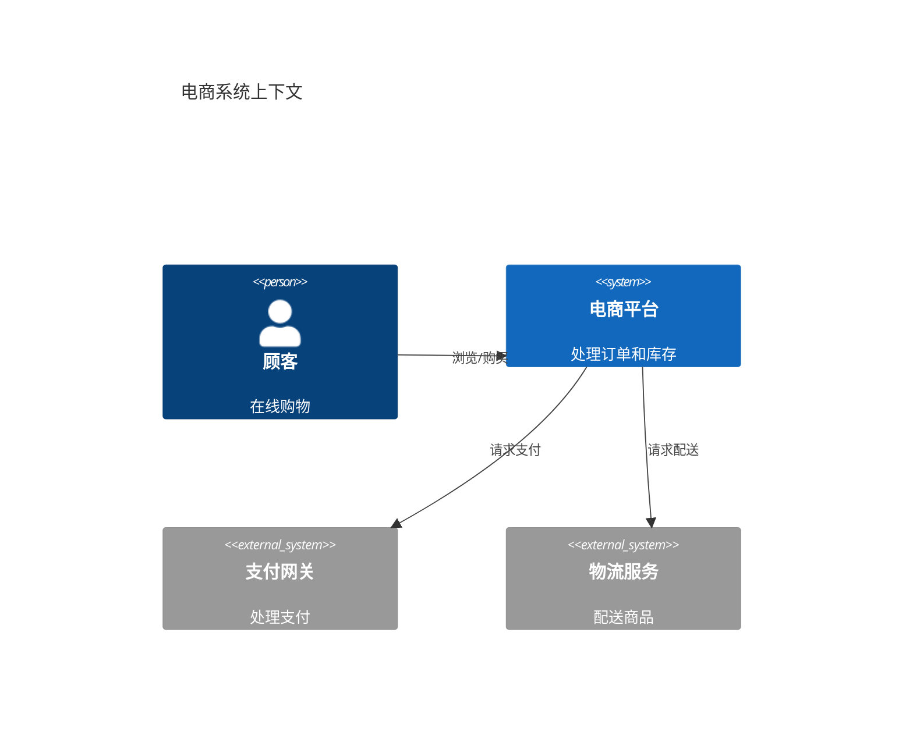

**关键验证点**：
- [ ] 4 个节点（Person/System/System_Ext/System_Ext）显示
- [ ] Person 用小人图标
- [ ] 3 条 Rel 边显示
- [ ] PNG 导出正常

---

## 第 3 部分：P2 图

### Case 3.1 — Timeline

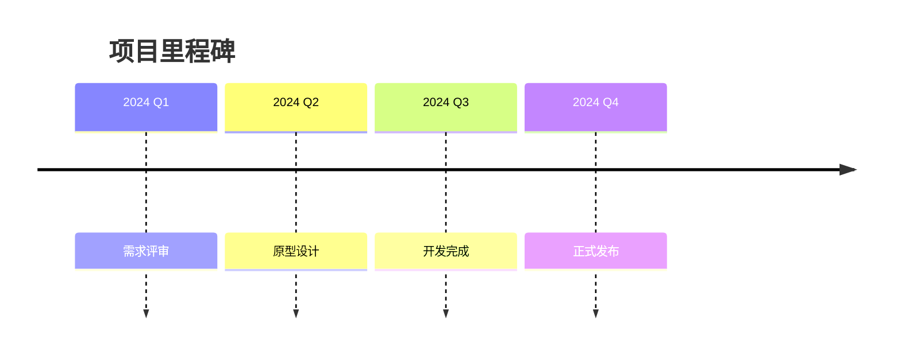

### Case 3.2 — Kanban

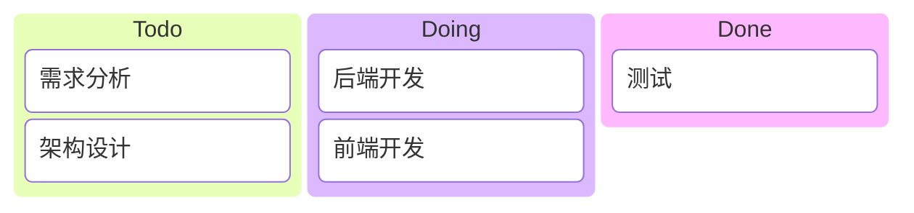

### Case 3.3 — Radar


### Case 3.4 — Treemap

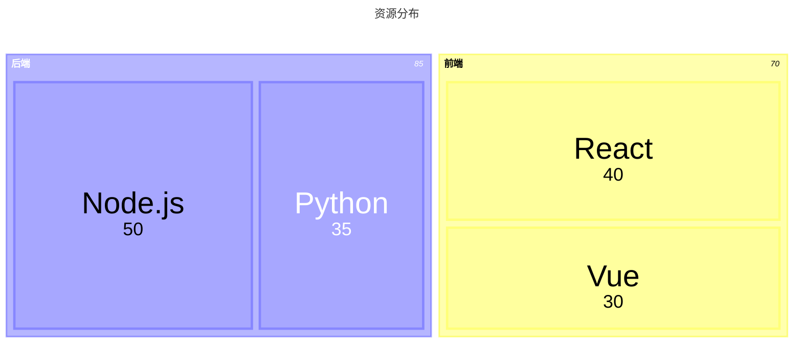

### Case 3.5 — Venn

```mermaid
venn-beta
set A[设计师]
set B[工程师]
set C[产品经理]
intersection(A, B) : "全栈"
intersection(A, C) : "设计思维"
intersection(B, C) : "技术决策"
intersection(A, B, C) : "技术合伙人"
```

---

## 第 4 部分：P3 图

### Case 4.1 — XY Chart

```mermaid
xychart-beta
title "月度销售"
x-axis [1月, 2月, 3月, 4月, 5月, 6月]
y-axis "销售额(万元)" 0 --> 100
line [20, 35, 45, 50, 65, 80]
bar [25, 30, 40, 55, 60, 75]
```

### Case 4.2 — Packet

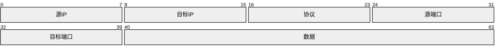

### Case 4.3 — Ishikawa (鱼骨图)

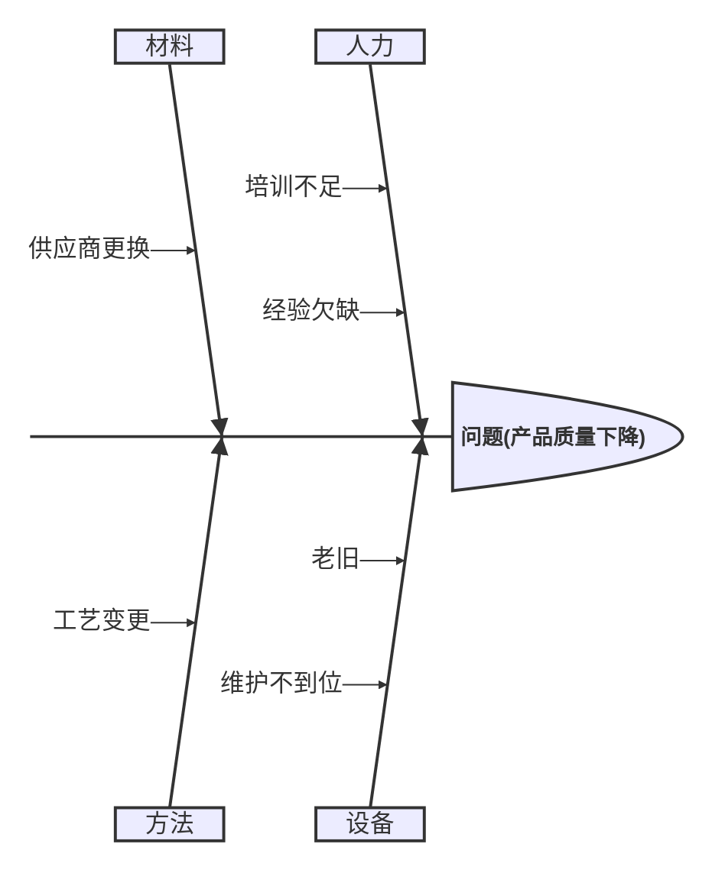

### Case 4.4 — Wardley

```mermaid
wardley
title 技术战略
axis 演化 --> 价值
CRM[0.7, 0.3]
ERP[0.85, 0.5]
BI[0.6, 0.7]
Cloud[0.9, 0.2]
```

### Case 4.5 — TreeView

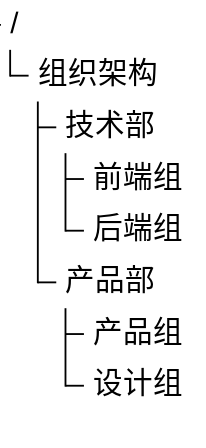

### Case 4.6 — ZenUML

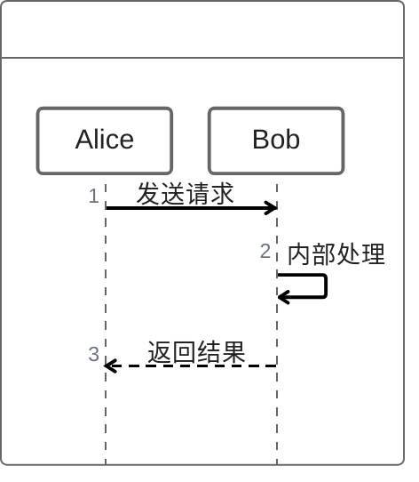

### Case 4.7 — Swimlanes

```mermaid
swimlanes
lane 用户
  提交订单
  等待确认
lane 系统
  验证订单
  处理支付
lane 商家
  发货
```

### Case 4.8 — Event Modeling


---

## 第 5 部分：v9 图回归（确保未破坏）

### Case 5.1 — Flowchart

```mermaid
flowchart TD
    A[开始] --> B{是否登录}
    B -->|是| C[主页]
    B -->|否| D[登录页]
    D --> C
```

### Case 5.2 — Sequence Diagram

```mermaid
sequenceDiagram
    participant U as 用户
    participant S as 服务器
    U->>S: 登录请求
    S-->>U: 登录成功
```

### Case 5.3 — State Diagram

```mermaid
stateDiagram-v2
    [*] --> 待支付
    待支付 --> 已支付: 支付
    已支付 --> 已发货: 发货
    已发货 --> [*]
```

### Case 5.4 — Class Diagram

```mermaid
classDiagram
    class User {
        +String name
        +login()
    }
    class Order {
        +int id
        +create()
    }
    User --> Order
```

### Case 5.5 — ER Diagram

```mermaid
erDiagram
    USER ||--o{ ORDER : places
    ORDER ||--|{ LINE_ITEM : contains
```

### Case 5.6 — Gantt

```mermaid
gantt
    title 项目计划
    dateFormat YYYY-MM-DD
    section 设计
    需求分析 :a1, 2026-01-01, 7d
    section 开发
    编码 :a2, after a1, 14d
```

### Case 5.7 — Pie Chart

```mermaid
pie title 市场份额
    "A 公司" : 40
    "B 公司" : 30
    "C 公司" : 20
    "其他" : 10
```

### Case 5.8 — User Journey

```mermaid
journey
    title 用户购物旅程
    section 浏览
      访问网站: 5: 用户
      搜索商品: 4: 用户
    section 购买
      加入购物车: 5: 用户
      提交订单: 3: 用户
      完成支付: 5: 用户
```

### Case 5.9 — GitGraph (v9 写法，验证 v11 仍接受)

```mermaid
gitGraph
    commit id: "init"
    commit id: "feat: login"
    branch feature/auth
    checkout feature/auth
    commit id: "auth spec"
    checkout main
    merge feature/auth
```

### Case 5.10 — GitGraph (v10 写法，**应失败**——验证 fix 函数仍必要)

```mermaid
gitGraph LR
    commit id: "x" &feature/y
```

期望：预览区显示"渲染失败" + 诊断提示（orientation + cherry-pick）。
**不通过标准**：v11 直接接受（说明 fix 函数该删了）→ 但 v11Compat 已确认仍拒绝，所以这里**必须失败才正常**。

### Case 5.11 — Requirement Diagram

```mermaid
requirementDiagram

requirement test_req {
id: 1
text: the test text.
risk: high
verifymethod: test
}

functionalEntity test_entity {
}

test_entity - satisfies -> test_req
```

---

## 执行记录

| 章节 | 通过 | 失败 | 备注 |
|---|---:|---:|---|
| 1. P0 (3 个) | /3 | | |
| 2. P1 (4 个) | /4 | | |
| 3. P2 (5 个) | /5 | | |
| 4. P3 (8 个) | /8 | | |
| 5. v9 回归 (11 个) | /11 | | |
| **总计** | **/31** | | |

> **R2 复审决策**：未通过的图应回 R2 实施方，决定（a）system.txt 加更严格约束 /（b）isMermaidCode 模式补漏 /（c）extractor 修新错误 /（d）确认 v11 解析器 bug 上游报告。

---

## 关联产物

- `tests/unit/v11Compat.test.js` — Node sandbox 实测 16 个样本（已确认 6 种新图可解析）
- `tests/unit/isMermaidCode.v11.test.js` — 25 种新图关键字识别
- `tests/manual/gitgraph-error-render.md` — gitGraph 错误诊断冒烟（8 case）
- `src/services/extractor.js` — isMermaidCode / extractMermaidCode 31 种关键字模式
- `prompts/system.txt` — 30 种图的语法约束
- `IMPLEMENTATION-R2.md §10.1` — 必须 R2 浏览器冒烟清单
