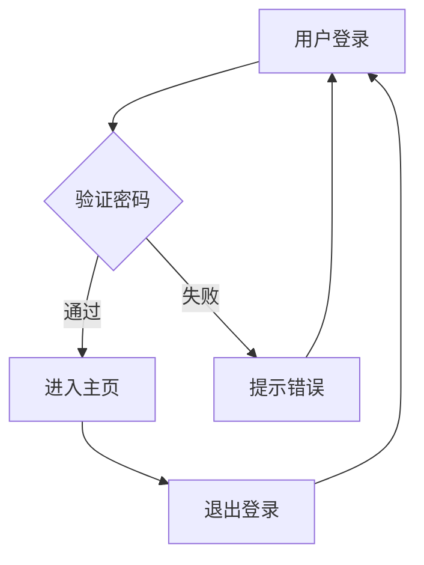
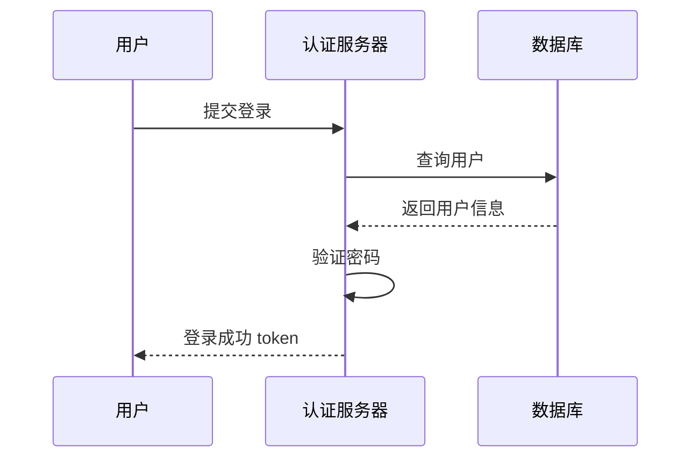
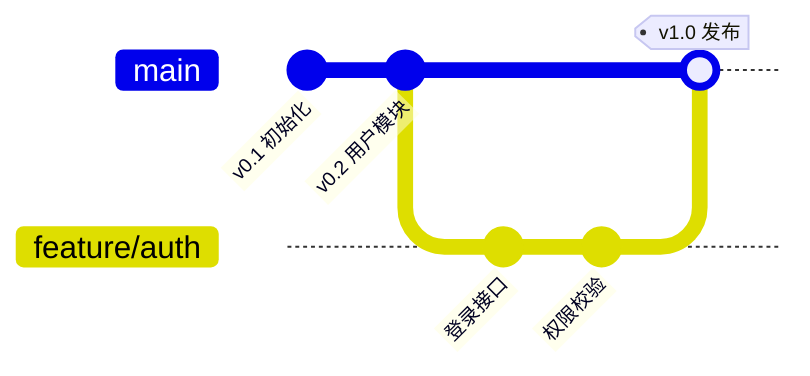
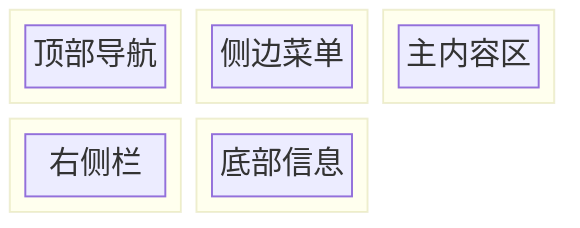

# PNG 导出兼容冒烟清单（6 种代表性图）

> **目的**：v11 SVG 输出格式可能与 `@resvg/resvg-wasm` 的解析路径不完全兼容（IMPLEMENTATION-R2 §10.1 "PNG 导出 v11 字体归一化"）。逐图手动导出 PNG，肉眼检查中文显示 + 节点完整。
>
> **依据**：IMPLEMENTATION-R2 §10.1 + §10.2 候选决策
>
> **已知风险**：
> - v11 SVG 可能含更复杂内联样式（v11 多 theme + CSS variables）
> - `resvg` 对部分 CSS variables 解析有限
> - 中文字体归一化（`normalizeFontFamily`）在 v11 仍工作（CLAUDE.md 强调纯文本节点）
> - HTML 标签 `<b>` `<i>` 等不被 resvg 渲染（system.txt 禁止）
>
> **执行方式**：
> 1. 启动服务：`node src/server/index.js`
> 2. 浏览器打开 `http://localhost:3000`，登录测试用户
> 3. 把每节代码贴到编辑器，等待渲染
> 4. 点击"导出 PNG"按钮
> 5. 验证：PNG 文件非空、字节数 > 1KB、中文显示正确、节点完整无截断
>
> **不通过标准**：PNG < 500B / 中文乱码 / 节点缺失 / 边截断 / 字体回退到默认

---

## 启动服务

```bash
cd /Users/setsunayang/Documents/GitHub/ProcessDown/.claude/worktrees/mermaid-upgrade
cp .env.example .env  # 填入 LLM_API_BASE_URL / LLM_API_KEY / LLM_MODEL
node src/server/index.js
# 浏览器打开 http://localhost:3000
```

---

## 6 种代表性图

### Case 1 — Flowchart (v9 基准回归)



**关键验证点**：
- [ ] 5 个节点（A/B/C/D/E）完整显示
- [ ] 中文 "用户登录" "验证密码" 等无乱码
- [ ] 4 条箭头方向正确
- [ ] PNG 字节数 > 3KB

### Case 2 — Sequence Diagram



**关键验证点**：
- [ ] 3 个 lifeline（U/S/DB）显示
- [ ] 4 条消息箭头 + 1 条自环
- [ ] 中文角色名"用户""认证服务器""数据库"无乱码
- [ ] PNG 字节数 > 2KB

### Case 3 — GitGraph (中文标签)



**关键验证点**：
- [ ] 4 个 commit 节点显示
- [ ] 1 个分支线（feature/auth）
- [ ] 中文 commit id 显示正常
- [ ] merge 节点显示 "v1.0 发布" tag

### Case 4 — Cynefin (P0 新图 + 中文)

```mermaid
cynefin-beta
title 决策框架
complex
"深度学习"
"试错迭代"
complicated
"专家咨询"
clear
"标准流程"
chaotic
"危机响应"
confusion
"未知分类"
clear --> chaotic : "自满"
complex --> complicated : "模式识别"
```

**关键验证点**：
- [ ] 5 个 domain 区域显示
- [ ] 标题"决策框架"显示
- [ ] 中文 label 显示正常（"深度学习" "专家咨询" 等）
- [ ] 2 条 domain 间箭头显示

### Case 5 — Sankey (P1 新图)

```mermaid
sankey-beta
煤,发电,40
天然气,发电,30
太阳能,发电,20
核能,发电,10
发电,居民用电,50
发电,工业用电,40
发电,损耗,10
```

**关键验证点**：
- [ ] 4 个源节点 + 3 个目标节点显示
- [ ] 7 条流线宽度按 value 比例渲染
- [ ] 中文节点名显示正常
- [ ] PNG 字节数 > 4KB（Sankey 视觉密度大）

### Case 6 — Block Diagram (P0 新图 + 嵌套)



**关键验证点**：
- [ ] 3 列布局
- [ ] 5 个嵌套 block 都显示
- [ ] 中文 label 显示正常
- [ ] PNG 字节数 > 3KB

---

## 验证清单

每个 case 导出后**在浏览器/图片查看器打开**：

| 检查项 | 通过 | 失败 |
|---|---|---|
| PNG 文件存在 / 字节数 > 1KB | | |
| 节点完整无截断 | | |
| 中文 label 正常显示（无方块/乱码） | | |
| 边方向正确 | | |
| 字体回退检查（思源黑体） | | |
| 无白边/底色正确（dark/light theme） | | |

---

## 字体归一化检查

`src/services/export.js` 里的 `normalizeFontFamily` 把所有 `font-family` 声明替换为思源黑体。验证：

1. 在 SVG 里 `grep` "SourceHanSansSC" 或 "思源黑体"——应能找到
2. 浏览器开发者工具看 SVG 的 `font-family` 属性——应是思源黑体
3. 导出 PNG 在多平台（macOS/Windows/Linux）打开，中文应一致

**命令验证**：
```bash
node -e "
const ExportService = require('./src/services/export');
const mermaid = require('./public/vendor/mermaid.min.js');
" 2>&1 | head -3
```

> 注：上面是示例——实际 `node` 不能直接 require 浏览器脚本。字体归一化逻辑在 `src/services/export.js` 的 `normalizeFontFamily` 函数里，单元测试不覆盖，需手动验证。

---

## 失败回退方案

如果某个图 PNG 导出失败或乱码：

1. **检查 server 日志** `run/processdown.log` —— 看 resvg 报什么错
2. **检查 SVG 源** —— 用浏览器开发者工具查看 `/api/export/png` 响应体里的 SVG
3. **检查字体归一化** —— `grep "font-family" <svg>`，应全是 `SourceHanSansSC`
4. **检查 v11 特殊样式** —— v11 可能在 `<style>` 标签内含 CSS variables；resvg 不解析 CSS variables 但应回退到默认

> 已知限制：v11 的 `flowchart.htmlLabels: true` + 中文 label 可能让 resvg 在某些字号下渲染异常。fallback：前端 `app.js:54-64` 把 `htmlLabels: true` 改成 `false`，中文 label 改用纯文本（`A[中文]` 而非 `A[<b>中文</b>]`）—— system.txt 已约束。

---

## 执行记录

> R2 实施人员跑完后追加：

| Case | 字节数 | 中文 OK | 节点完整 | 备注 |
|---|---:|---|---|---|
| 1 Flowchart | | | | |
| 2 Sequence | | | | |
| 3 GitGraph | | | | |
| 4 Cynefin | | | | |
| 5 Sankey | | | | |
| 6 Block | | | | |

---

## 关联产物

- `src/services/export.js` — SVG→PNG 转换 + 字体归一化
- `assets/fonts/SourceHanSansSC-Regular.otf` — 思源黑体字体
- `prompts/system.txt` — 禁止节点文本用 HTML 标签（resvg 不渲染）
- `IMPLEMENTATION-R2.md §10.1` — PNG 导出 v11 字体归一化
- `tests/export.test.js` — 手动 PNG 渲染脚本（无断言，仅供肉眼检查）
