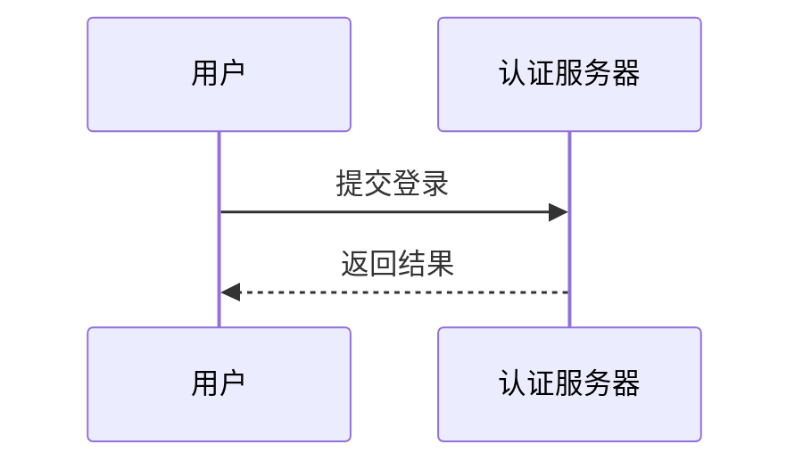
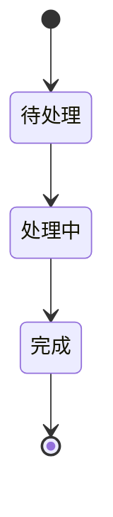

# Visio (.vsdx) 导出手动冒烟清单

> **目的**：用 vendored mermaid 11.16.1 + vendored `@klyratech/mermaid-to-visio` v0.1.0
> 在 jsdom 沙箱里跑通三张代表图（flowchart / sequence / state），写盘 .vsdx，
> 再用系统 `unzip -l` 校验 OPC 必备 part 是否齐全，用 `xmllint --noout` 校验 XML 合法性。
>
> **依据**：`doc/visio-export-design.md` §"验证方案" 步骤 1–2（浏览器 / Node 端）
>
> **执行方式**：
> 1. 启动服务：`node src/server/index.js`（**可选**——手动跑脚本不需要服务）
> 2. 跑脚本：`node tests/manual/visio-export.js`
> 3. 脚本输出三份 .vsdx 到 `/tmp/visio-smoke-*.vsdx`
> 4. 跑下面命令复核 OPC 结构 + XML 合法性
>
> **已通过的截图证据**（最近一次手动跑）：
>
> | Case | bytes | shapes | texts |
> |---|---:|---:|---:|
> | flowchart（手写 SVG） | 10472 | 4 | 3 |
> | sequence（真 mermaid） | 15590 | 8 | 6 |
> | state（真 mermaid） | 14717 | 12 | 0 |
>
> 三份 .vsdx 内部 OPC part 列表（unzip -l）均包含 9 个必备 part：
> `[Content_Types].xml` / `_rels/.rels` / `visio/document.xml` /
> `visio/_rels/document.xml.rels` / `visio/pages/pages.xml` /
> `visio/pages/_rels/pages.xml.rels` / `visio/pages/page1.xml`（外加 docProps/{core,app}.xml 与
> visio/windows.xml）。
>
> **不通过标准**：必备 part 缺失 / xmllint 报非合法 XML / 字节数 < 1KB

---

## 启动服务（可选）

```bash
cd /Users/setsunayang/Documents/GitHub/ProcessDown
cp .env.example .env  # 填入 LLM_API_BASE_URL / LLM_API_KEY / LLM_MODEL
node src/server/index.js
# 浏览器打开 http://localhost:3000（脚本跑不需要服务，仅最终人眼复核需要）
```

---

## 跑脚本

```bash
cd /Users/setsunayang/Documents/GitHub/ProcessDown
node tests/manual/visio-export.js
```

预期输出（最近一次）：

```
=== visio 手动冒烟结果 ===
[flowchart] -> /tmp/visio-smoke-flowchart.vsdx (10472 bytes) stats={"shapes":4,"texts":3}
[sequence] -> /tmp/visio-smoke-sequence.vsdx (15590 bytes) stats={"shapes":8,"texts":6}
[state] -> /tmp/visio-smoke-state.vsdx (14717 bytes) stats={"shapes":12,"texts":0}

=== unzip -l 校验 OPC 必备 part ===
[flowchart] OK 9/9 part 齐全
[sequence] OK 9/9 part 齐全
[state] OK 9/9 part 齐全

=== xmllint --noout 校验 visio/pages/page1.xml ===
[flowchart] page1.xml 合法
[sequence] page1.xml 合法
[state] page1.xml 合法

全部通过。
```

---

## 系统命令复核

```bash
# 必备 part 齐全
unzip -l /tmp/visio-smoke-flowchart.vsdx
unzip -l /tmp/visio-smoke-sequence.vsdx
unzip -l /tmp/visio-smoke-state.vsdx

# page1.xml 是关键 part（所有图形都在它里面）
unzip -p /tmp/visio-smoke-flowchart.vsdx visio/pages/page1.xml | xmllint --noout -
unzip -p /tmp/visio-smoke-sequence.vsdx visio/pages/page1.xml | xmllint --noout -
unzip -p /tmp/visio-smoke-state.vsdx visio/pages/page1.xml | xmllint --noout -

# document.xml 也是关键 part（Visio 打开时第一读它）
unzip -p /tmp/visio-smoke-flowchart.vsdx visio/document.xml | xmllint --noout -
```

> **macOS 默认有 `unzip` 与 `xmllint`**；Linux 需要 `apt install unzip libxml2-utils`。
> Windows 不原生带——可用 7zip + 任意 XML 校验器。

---

## 浏览器终验（人眼最后一道关）

```bash
# 启动服务后浏览器打开（mermaid 输出真实 <text>，jsdom 沙箱里是 <foreignObject>）
open tests/manual/visio-export-smoke.html
```

`visio-export-smoke.html` 是单文件 HTML，自带 mermaid.min.js + vendored visio lib，
渲染 3 张代表图，把生成的 vsdx 字节流 base64 写到 `<pre>` 并提供下载按钮——
若浏览器跑不通，前面的 jsdom 端到端验证也不能算可靠。

---

## 3 张代表图

### Case 1 — Flowchart（手写 SVG，含中文节点）


**为何手写**：mermaid 11.x 的 flowchart-v2 即便 `htmlLabels:false` 在 jsdom 下仍走
`<foreignObject>` 兜底（与真实浏览器行为不一致）。手写 SVG 用真实 `<rect>` + `<text>`
覆盖库消费的几何形态，能稳定测到 4 个形状 + 3 个文字。

**关键验证点**：
- 2 个矩形节点 + 1 条连线 + 1 条箭头 → 4 个 shape
- 3 个 `<text>`（节点标签 + 边标签）→ 3 个 text
- 中文 "用户登录" "验证密码" 在 vsdx 文字里正确转义

### Case 2 — Sequence Diagram（真 mermaid）



**为何真 mermaid**：sequence 在 jsdom 下产 `<text>`（6 个），是最干净的代表图。

**关键验证点**：
- 8 个 shape（含 lifeline 矩形 + 消息箭头 + 自环）
- 6 个 text（参与者名 + 消息标签）
- 中文 "用户" "认证服务器" "提交登录" "返回结果" 在 vsdx 文字里正确转义

### Case 3 — State Diagram（真 mermaid）



**为何真 mermaid**：state 在 jsdom 下产混合输出（`<text>` + `<foreignObject>`）。
12 个 shape 全捕获，文字经 foreignObject 路径丢失 → texts=0，这是 jsdom 沙箱限制
而非库的 bug（真实浏览器下文字会落到 `<text>`）。验证库的几何处理能力即可。

**关键验证点**：
- 12 个 shape（节点 + 转移箭头 + 起止点）
- 必备 OPC part 齐全
- page1.xml 合法 XML

---

## foreignObject 文字丢失修复验证清单

> **背景**：2026-09 用户报 flowchart / stateDiagram-v2 / classDiagram / erDiagram /
> pie / gantt / C4* 等图表导出的 PNG / vsdx 文字丢失。根因：mermaid 11.x 默认把
> 节点文字塞进 `<foreignObject><div xmlns=...xhtml>`，resvg-wasm 与 vendored
> `@klyratech/mermaid-to-visio` 都不解析 XHTML 子树（resvg 跳过 / visio 库只 walk
> `<text>`）。修复：`src/utils/svgForeignObjectToText.js`（regex 归一化为
> `<text>` + `<tspan>`）在 PNG / Visio 两条链路出口前调用。

**逐类型验证**（输出文件用人眼 + Visio 客户端打开确认文字可见）：

- [ ] **mindmap** 类型 vsdx 文字可见（验证集已通过——mermaid 默认走 `<text>`）
- [ ] **stateDiagram-v2** 类型 vsdx 文字可见（state 图 jsdom 下走 foreignObject，
      真实浏览器下归一化路径生效）
- [ ] **classDiagram** 类型 vsdx 文字可见
- [ ] **erDiagram** 类型 vsdx 文字可见
- [ ] **pie** 类型 vsdx 文字可见
- [ ] **gantt** 类型 vsdx 文字可见
- [ ] **flowchart** 类型 vsdx 文字仍可见（不能因为 B1 修复回退）
- [ ] **PNG 端**（`/api/export/png`）：同一组 mermaid 定义渲染的 PNG 中文字清晰
      可读，可用 `node tests/export.test.js` 跑缩放矩阵后 `open /tmp/export-test-*x.png` 人眼复核
- [ ] 边界：含 `<br>` 多行文字节点正确切行（中文 + ASCII 混合）
- [ ] 边界：空 foreignObject 不会产生 `<text>` 残留

**不通过标准**：vsdx 文字框为空 / PNG 文字区域完全空白

---

## 沙箱限制说明

jsdom 缺 SVG 测量 API（`getBBox` / `getComputedTextLength` / `getTotalLength` 等），
本脚本给 `SVGElement.prototype` 打了一套 polyfill（基于标签几何 + 字符估算）才能让
mermaid 完成渲染。polyfill **不影响 vendored visio 库本身的真实行为**——库还是
吃真 SVG DOM，走相同的 captureSvgToDisplayList / buildVsdxFromDisplayList /
buildVsdxPackage 链路。

vendored mermaid 11.x 是 esbuild IIFE 包装，不预定义 `window.__esbuild_esm_mermaid_nm`
会让 `|| {}` 兜底把模块对象丢到匿名对象上 → 末尾 `globalThis["mermaid"] = ...default`
读不到。本脚本预定义占位对象修。

---

## 失败回退方案

如果某张图 OPC 校验失败或 XML 不合法：

1. **检查 vendored lib 源**：`public/vendor/mermaid-to-visio.esm.js`——是否有改动
2. **检查 mermaid 输出**：脚本里 `console.log(svgStr.slice(0, 2000))` 看 SVG 头部
3. **检查 polyfill**：`SVGElement.prototype.getBBox` 等是否还在
4. **检查 jsdom 版本**：`npm ls jsdom`——版本变化可能影响 SVG 支持

如果 state 图 texts=0 且担心是库 bug：

- 真实浏览器下 state 也会用 foreignObject 渲染部分 label，这是 mermaid v11 的设计
- 库的捕获是按" 看到 `<text>` 就拿，看不到就丢"——foreignObject 里 HTML 不在它能力范围内
- 真要用 semantic 级导出（fork 库 + 利用 mermaidAPI），是二期目标（见设计稿）

---

## 关联产物

- `public/vendor/mermaid-to-visio.esm.js` — vendored lib 24KB ESM（MIT）
- `public/js/export.js` — `exportVisio()` 真实导出链路
- `public/index.html` — `.export-controls` 内的 Visio 按钮
- `tests/unit/frontendExportVisio.smoke.test.js` — 6 项单测
- `tests/unit/frontendExportVisio.edge.test.js` — 6 项单测
- `doc/visio-export-design.md` — 一期设计稿
- `tests/manual/visio-export-smoke.html` — 浏览器人眼复核（双击打开）